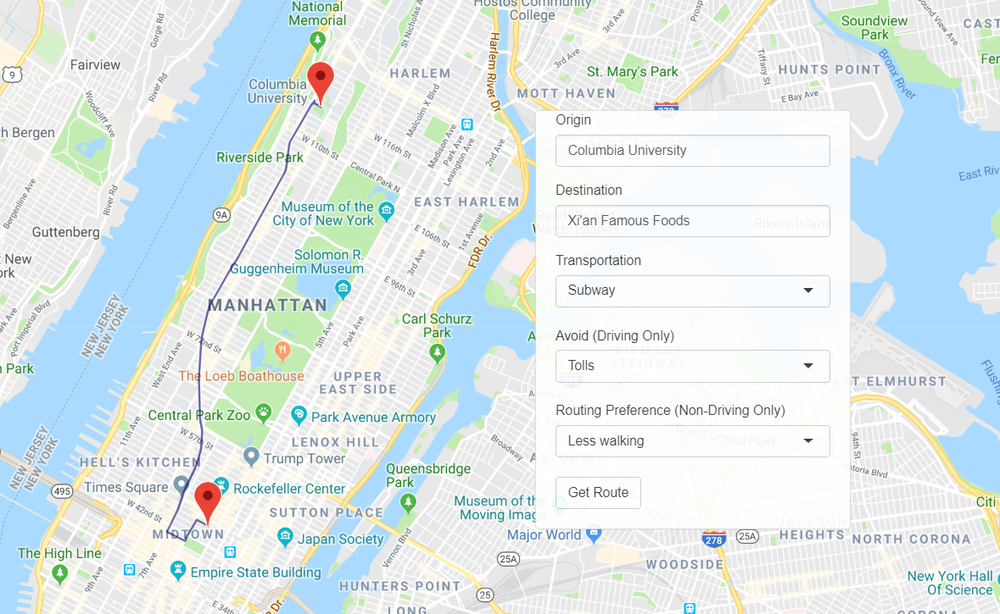

# Project 2: Shiny App Development Version 2.0

## **Safe Dining**: http://project2-group6.shinyapps.io/app_final
+ Yuting He
+ Andy Huang
+ Wensong Qiao
+ Jason Shu
+ Xi Yang

Diners in NYC deserve to know the safety of their choice of restaurant, both externally with regards to the crime rate of surrounding neighborhoods, as well as internally concerning how safe the food is to eat. In Project 2, our group combines multiple datasets and utilities in order to provide this information to a consumer who would like to pick from a restaurant. 

The app includes functionality for choosing and filtering between:

+ Restaurant Category/Cuisine
+ Price
+ Online Rating 
+ Crime Rate (At specific time of arrival/departure)
+ Heat Map of rat activity
+ Removal of restaurants that have had food safety complaints
+ Manual entering of restaurant name
+ Separate tab that provides directions to the restaurant of your choosing
+ Hyperlinks directing to the google search for the selected restaurant
+ Preferences for travel, including type of transportation and preferred routes

---
+ **Contribution statement**: ([default](doc/a_note_on_contributions.md)) 

  + Jason Shu: Searched for relevant data, content and grammar check, README file and code editing
  + Andy Huang: Download restaurant data from yelp API & found recent crime data; UI design & improvement; coded 1st tab content(restaurant & crime); Final Debug 
  + Xi Yang: develope and improve the navigation tab (the second tab) using google map API and googleway package; UI design & improvement
  + Yuting He: Designed and coded the home page,  background and  theme. Beautified the app.
  + Wensong Qiao:Clean data for Rat;Make heatmaps for Rat distribution and Crime distribution;Add geojson for NYC boroughs.

